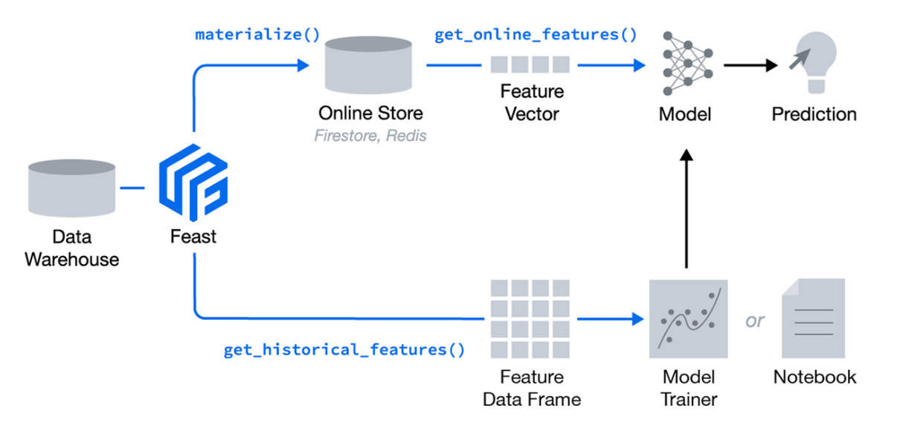
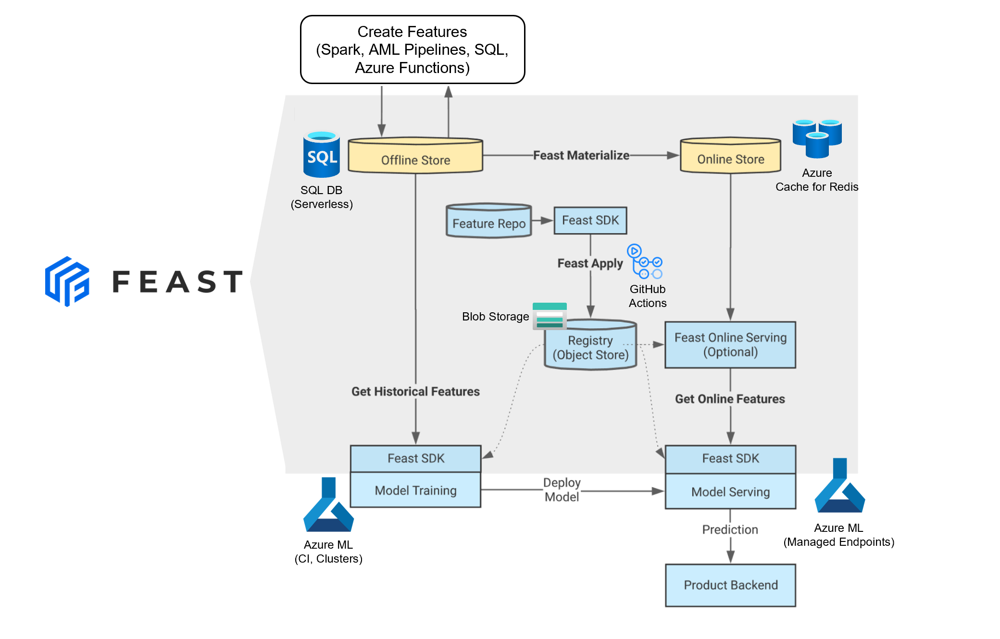
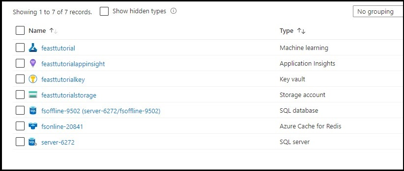
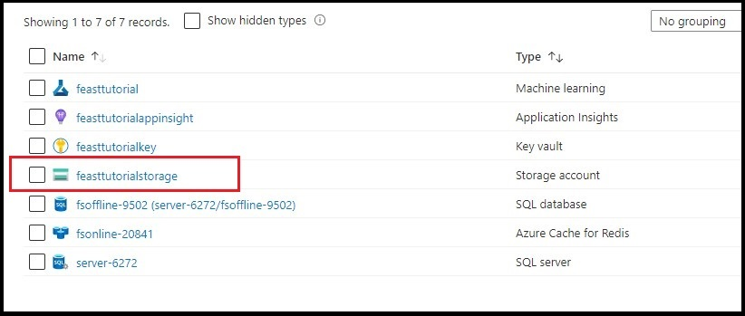
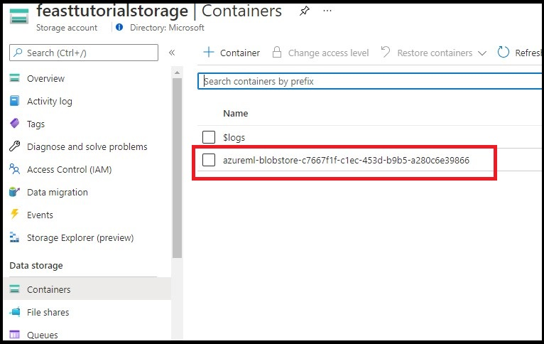
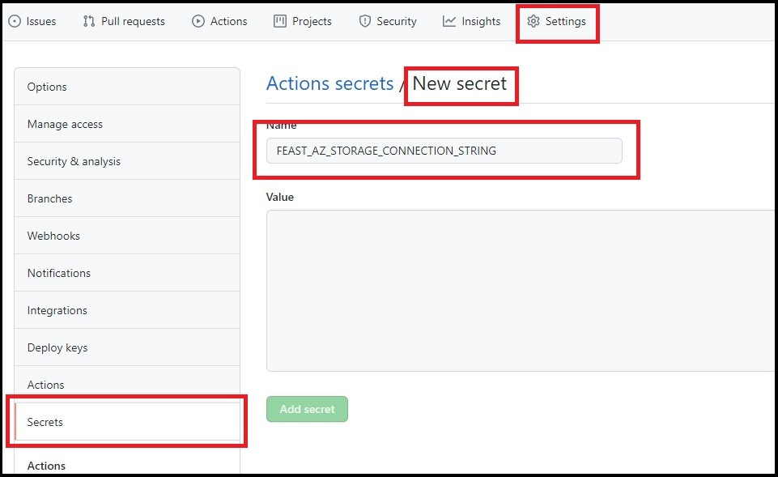
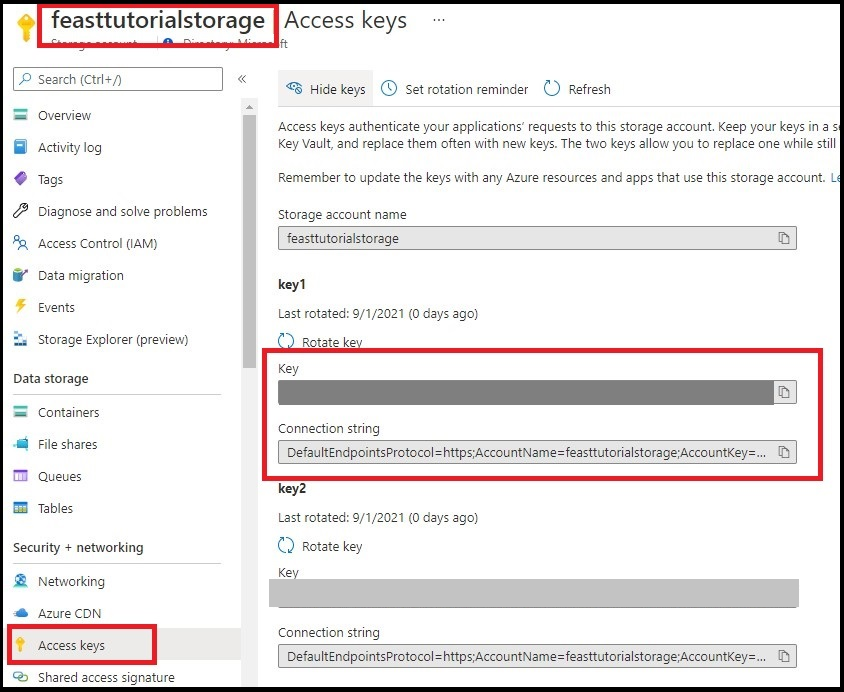
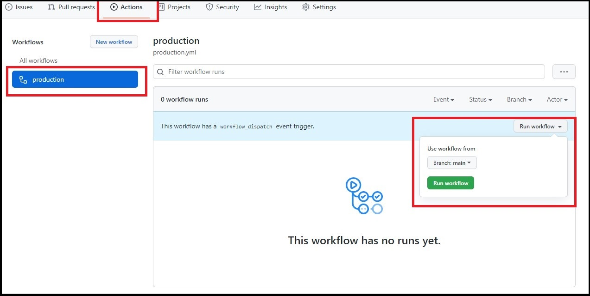

[](https://github.com/samuel100/feast-aml-example/actions/workflows/production.yml)

# Feast in Azure ML
Feast (Feature Store) is an operational data system for managing and serving machine learning features to models in production. Below provides a high-level architecture:



[This article provides a good overview of feast](https://docs.feast.dev/) and the benefits of a feature store.

In this tutorial you will:

1. Create a feature store with SQL DB (serverless)
1. Execute a CI/CD pipeline to publish a feature registry (metadata)
1. Consume features from the feature store to train a model
1. Materialize features to an Azure cache for redis (online store) for inference
1. Create a real-time endpoint that consumes features from the online store.

This repository contains 4 folders:

1. __setup.__ This contains files to set up connection strings in the Azure ML Keyvault and load data into the feature store.
1. __producer.__ This contains the files to produce features.
1. __consumer.__ This contains a notebook that consume features from the feature store into a model and deploys the model.
1. __.github/workflows__. This contains the workflows that produce the features.

In reality, the producer directory would be a repository in its own right.
## Producer
Has a minimal Feast CI structure:
* It contains two feature repositories, one for `staging` and one for `production`
* Any changes to either the `production/` or `staging/` feature repositories will trigger a CI pipeline which will update your Feast infrastructure.

## Prereqs

For this tutorial you will require:

1. An Azure subscription
1. An Azure ML Workspace
1. A GitHub account
1. Good working knowledge of Python and ML concepts.
1. Basic understanding of Azure ML - using notebooks, job submission, etc.

## Architecture
Below overlays the Azure components used in this tutorial. 



## Set up your environment

### Create compute instance

1. From the [Azure ML studio home page](https://ml.azure.com), select __New__ > __Compute instance__. Follow the on-screen instructions to create a compute instance. 
   You should give the compute instance a name and choose a size (Standard_DS3_v2 is a good choice). The remaining choises you can leave at its default. 

1. From GitHub select __Use this template__ to copy this repo into your own repo. Once you have the template, clone it on the Azure ML compute instance [using the terminal](https://docs.microsoft.com/en-us/azure/machine-learning/how-to-access-terminal).

```bash
git clone https://github.com/<Your Github name>/<Your repo name>
cd <Your repo name>
```

1. Install the pip packages (feast, pymssql, etc) into the `azureml_py36` conda environment:

```bash
conda activate azureml_py36
pip install -r requirements.txt
```
__NOTE: This current implementation requires Python 3.6__.  

> __Known Issue:__ Installing the pip egg may fail in the `azureml_py36` env. If this occurs, you can fix it by running `pip uninstall -y enum34`.


> __Important:__ All comands has to be run from the directory created by your git glone step. So, if you _either youself or is asked to_ start a new terminal please remember to issue the command `cd <Your repo name>` and a login to Azure using `az login`


### Create a SQL DB (Offline Store)

The features will be stored in a __serverless__ SQL DB. This is to conserve cost while you learn feast. For additional scale you can swap SQL DB for a Synapse Dedicated SQL Pool (formerly SQL DW).

In your compute instance, open a terminal and login to azure using the following command
```bash
az login
```
> __Possible Issue:__ If an error occurs in the login, you can fix it by running `pip install --upgrade azure-cli`.

After a succesfull login issue the following commands to create an Azure SQL DB.

> __NOTE:__ 
Please, feel free to adjust the variables __resourceGroupName__, __location__, __adminlogin__, __password__, __serverName__ and __sqldbName__ to your preferred values.
If you make changes make a note of this as these are used in through out the tutorial.

> __Note:__ Make sure that you use the right subscription in case you have access to more than one.


```bash
# Set the resource group name and location for your server
resourceGroupName=myResourceGroup
location=eastus

# Set an admin login and password for your database
adminlogin=azureuser
password=Azure1234567!

# Set a server name that is unique to Azure DNS
serverName=server-$RANDOM
echo "Variable serverName is set to $serverName"

# a databasename
sqldbName=fsoffline-$RANDOM
echo "Variable sqldbName is set to $sqldbName"

# create resource group
az group create --name $resourceGroupName --location $location

az sql server create \
    --name $serverName \
    --resource-group $resourceGroupName \
    --location $location  \
    --admin-user $adminlogin \
    --admin-password $password

# Create a firewall rule that allows access from Azure services
az sql server firewall-rule create \
    -g $resourceGroupName \
    -s $serverName \
    -n myrule \
    --start-ip-address 0.0.0.0 \
    --end-ip-address 0.0.0.0

az sql db create \
    --resource-group $resourceGroupName \
    --server $serverName \
    --name $sqldbName \
    --edition GeneralPurpose \
    --compute-model Serverless \
    --family Gen5 \
    --capacity 2
```


> __Important:__ Take a note of the variable __serverName__ and __sqldbName__ as you will need them in a later step.


### Create Azure Cache for Redis (online store)

For accessing features for real-time inference we use an Azure Cache for Redis. In this tutorial we use a basic instance to conserve cost.

In your compute instance, open a terminal and issue the following commands to create an Azure Cache for Redis.
Please adjust the variable __resourceGroupName__ and __location__ accordingly and feel free to change and record the variable __redisName__.

```bash
# Set the resource group name and location for your server
resourceGroupName=myResourceGroup
location=eastus

# a redis name
redisName=fsonline-$RANDOM
echo "Variable redisName is set to $redisName"

az redis create \
    --location $location \
    --name $redisName \
    --resource-group $resourceGroupName \
    --sku Basic \
    --vm-size c1 \
```
> __Note:__ Take a note of the variable __redisName__ as you will need them in a later step.

### Created services

At this point in the tutorial, you should have these services in your resourcegroup, with naming of your choice.




### Add your connection strings to the Azure ML keyvault
The offline and redis stores will be used when you come to consume feastures for training and inference. So that keys are not revealed, we use keyvault that is provisioned with your Azure ML workspace to store the connection strings. 

Please use the noted values for __serverName__, __sqldbName__, __redisName__ and (if changed) __resourceGroupName__, __adminlogin__, __password__ accordingly.

In your compute instance, open a terminal and run the following commands (note we have created a utility python script to store your connections strings):

Before running the commands please activate the conda environment using this command:

```bash
conda activate azureml_py36
```

```bash
# Set the resource group name and location for your server
resourceGroupName=myResourceGroup

# Set an admin login and password for your database
adminlogin=azureuser
password=Azure1234567!

# Set a server name that is unique to Azure DNS
serverName=<value registered above>

# a databasename
sqldbName=<value registered above>

# a redis name
redisName=<value registered above>

FEAST_SQL_CONN="mssql+pyodbc://$adminlogin:$password@$serverName.database.windows.net:1433/$sqldbName?driver=ODBC+Driver+17+for+SQL+Server&autocommit=True"

# get redis password
redisKey=$(sed -e 's/^"//' -e 's/"$//' <<<$(az redis list-keys --name $redisName -g $resourceGroupName --query primaryKey))

FEAST_REDIS_CONN=$redisName.redis.cache.windows.net:6380,password=$redisKey,ssl=True

cd setup
python set_secrets.py --feast_sql_conn $FEAST_SQL_CONN --feast_redis_conn $FEAST_REDIS_CONN
```

> __Possible Issue:__ If an error occurs, you can fix it by running `pip install azureml-sdk[notebooks]`


### Load features into Feature Store
Feast does not handle transformations nor loading of data into your feature store - this occurs outside of feast. You can use ADF, Azure ML Pipelines, SQL, Azure Functions, etc to manage the orchestration of feature creation and loading.

For this tutorial, we will create and load features into the store using a python script. 

In your compute instance, open a terminal and run the following:

```bash
conda activate azureml_py36
cd setup
python load_data.py
```

> __Note:__ If you get a timeout error, please retry the `python load_data.py`. 


## Feast `apply()` with GitHub actions

The GitHub workflow publishes versioned controlled feature definitions using feast `apply`. This CLI command updates infrastructure and persists definitions in the feature store _registry_. 

To ensure that Azure ML can access the registry on blob, you will need to update the `registry` value in [`feature_store.yaml`](producer/production/feature_store.yaml) to point to a location on your blob account:

```txt
az://<CONTAINER_NAME>/<PATH_ON_BLOB>/registry.db
```

If you want to use the Azure ML storage account for the registry.db file you can find this settings by navigating to the resource-group for you Azure ML account.




The value for <CONTAINER_NAME> in this case is then __feasttutorialstorage__

The value for <PATH_ON_BLOB> would then be __azureml-blobstore-c7667f1f-c1ec-453d-b9b5-a280c6e39866__ 


### Create a GitHub secret

You need to create a GitHub secret so that the workflow can access your blob storage account. In your GitHub repo go to __Settings__, select __secrets__ in the left-hand menu, and __New repository secret__. You should see the screen below.

Ensure you name the secret __FEAST_AZ_STORAGE_CONNECTION_STRING__ and paste in your blob connection string. It is __important__ that you must use this name for the secret.



The connection string for the blob string is in the format _DefaultEndpointsProtocol=https;AccountName=X;AccountKey=XXX;BlobEndpoint=https://XX.blob.core.windows.net/_

So, again, if you want to use the Azure ML storage account as shown above the connection string would then
_DefaultEndpointsProtocol=https;AccountName=feasttutorialstorage;AccountKey=XXX;BlobEndpoint=https://feasttutorialstorage.blob.core.windows.net/_

You can find the account key needed under __Access Keys__




### Run the workflow
For this tutorial, the workflow is run manually - if you want to run this on a push then you can update the .github/workflows/production.yml file.

In your GitHub repo go to __Actions__, select the __production__ workflow, and then __run workflow__:



The workflow will take ~2minutes to complete. 

## Train and Deploy a model using the Feature Store

Follow the `train_and_deploy_with_feast` notebook in consumer directory of this repo to understand how to train and deploy a model using feast.

